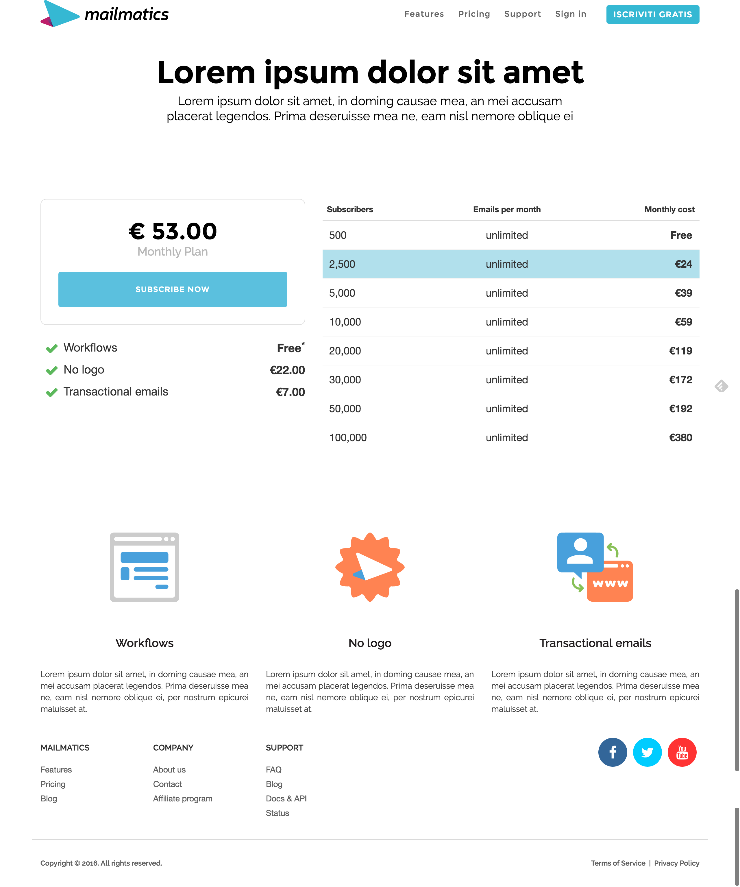
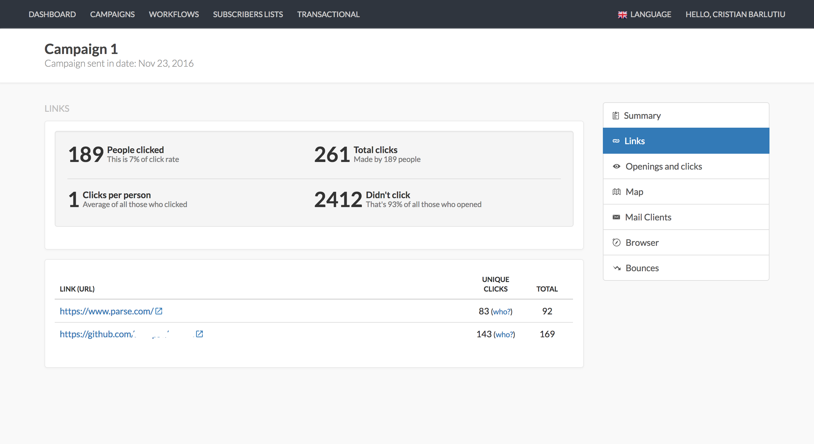
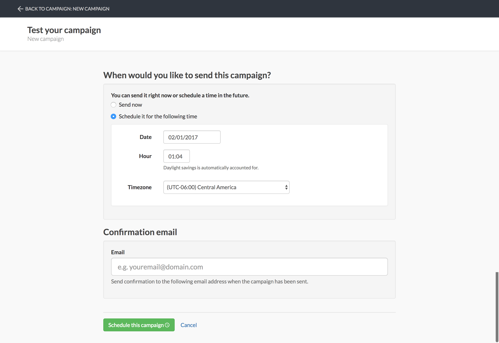

# Mailmatics

**Mailmatics** offers an easy way to connect with your audience through email marketing, including auto-responders, lists segments, RSS feeds and more. Everything was built from the ground up using Node JS and Angular JS.

### Technologies used
* Node JS back-end built from the ground up
* Angular + responsive **HTML5** and **CSS3** based front-end
* MySQL database

### My contribution
* built everything from the ground up
* project leader
* content management and functionality 
* UI and UX

## Landing



## Dashboard

## Campaigns

## Campaign summary






## New campaign wizard







## Workflows

## Subscribers


## Segments


## Transactional emails


