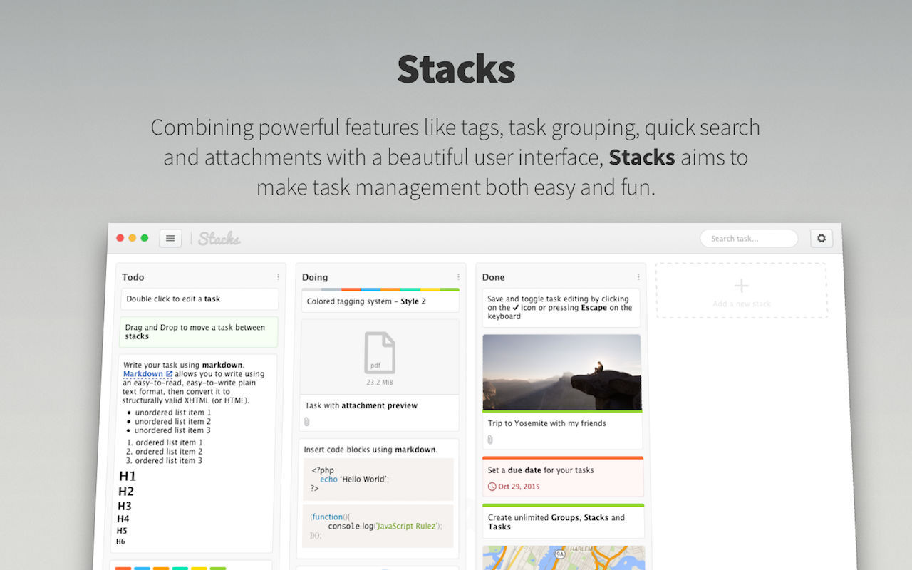
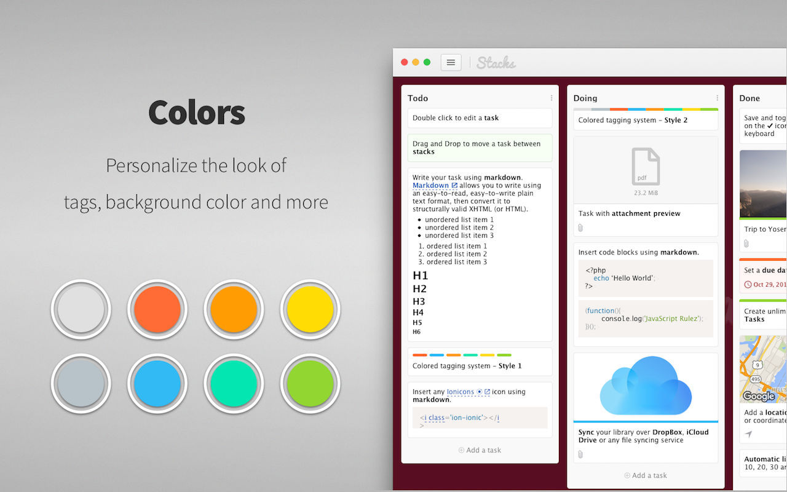
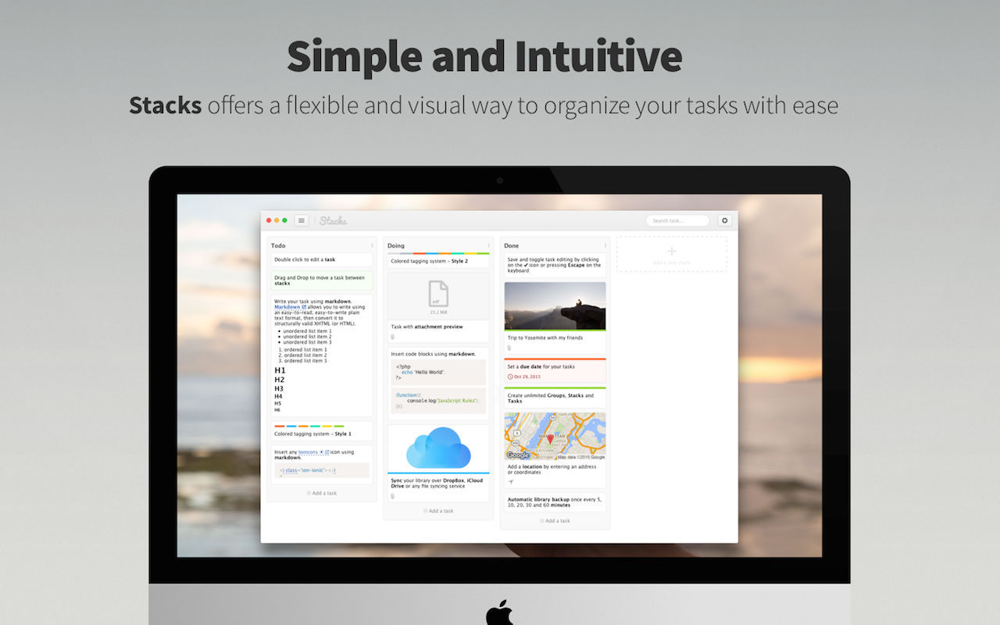

# Stacks 

Stacks is an easy to use task manager that helps to organize your tasks in an elegant and intuitive way. Using kanban paradigm for managing your projects Stacks offers a flexible and visual way to organize your tasks with ease. Combining powerful features like tags, task grouping, quick search and attachments with a beautiful user interface, Stacks aims to make task management both easy and fun.

Features:

- Colored tagging system
- Quick task search
- Task attachment
- Mark task as complete or to do
- Sync through iCloud Drive, Dropbox or any other file syncing service
- Attachment preview
- Write your tasks in Markdown
- Add address or coordinates and preview the map with zoom
- Add a link
- Automatic backup of your library
- Drag and Drop
- Task due date
- Create reminder and calendar event from task
- Beautiful image preview

