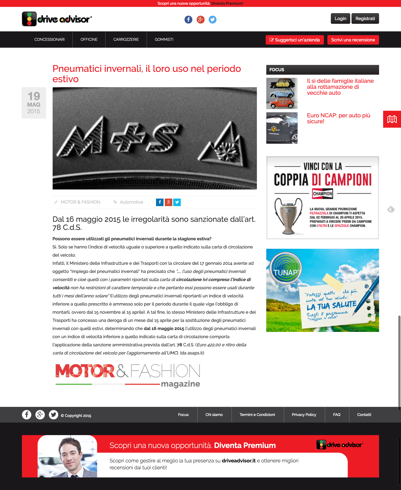
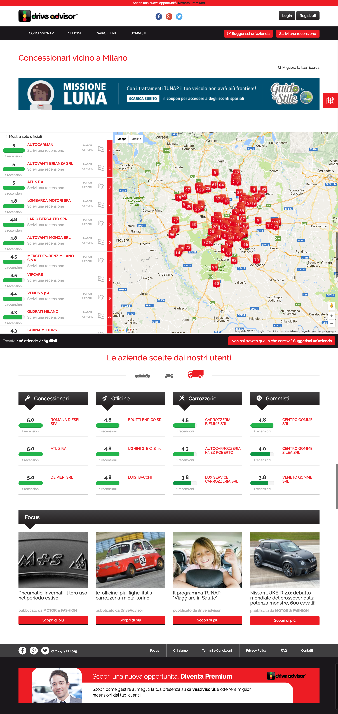
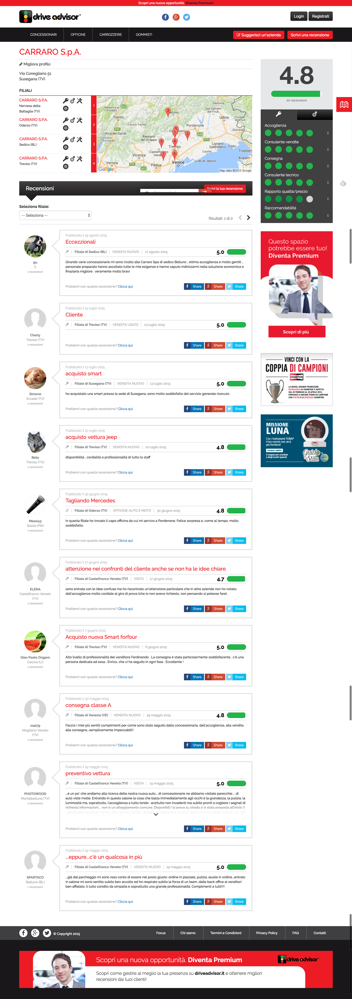

# Drive Advisor

Drive Advisor was built to be the next TripAdvisor but car related.

### Technologies used
* built from the ground up using **my own** open source [PHP framework](https://github.com/synapse/Synapse-Framework) for the server side API layer
* responsive **HTML5** and **CSS3** based front-end powered by **jQuery** and **Boostrap 3.x**
* front-end is a **SPA** (Single Page Application) web app built using **Angular 1.x**

### My contribution
* built the server side PHP framework
* build front-end web app
* built back-end web app
* team coordination
* skinned web site

## Home page

## News


## Search


## Service

