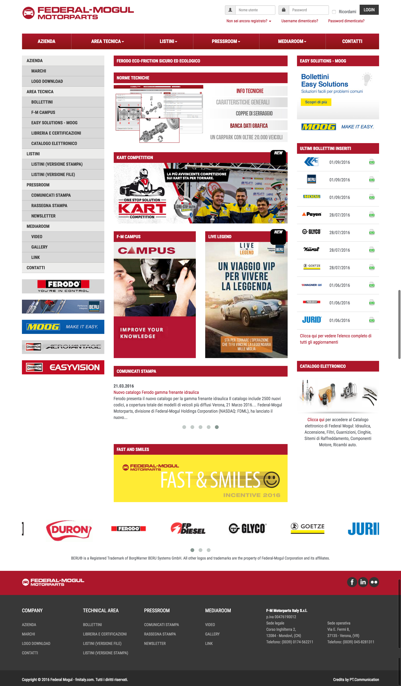
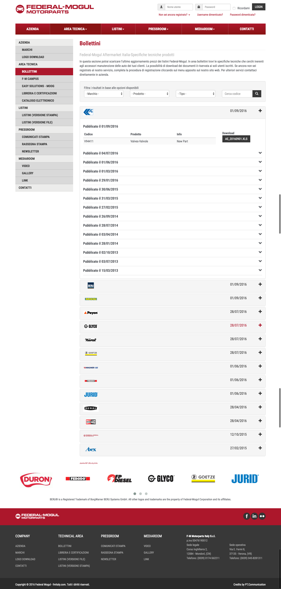
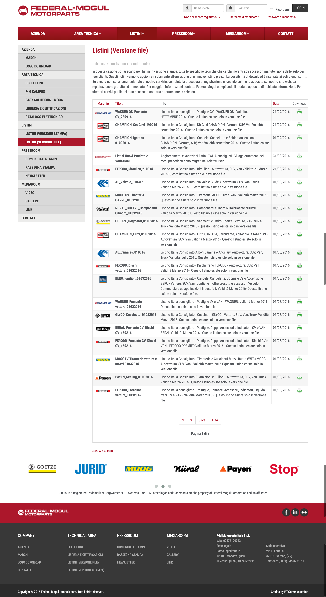
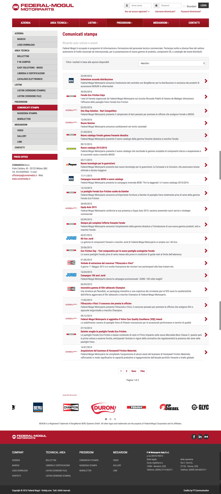
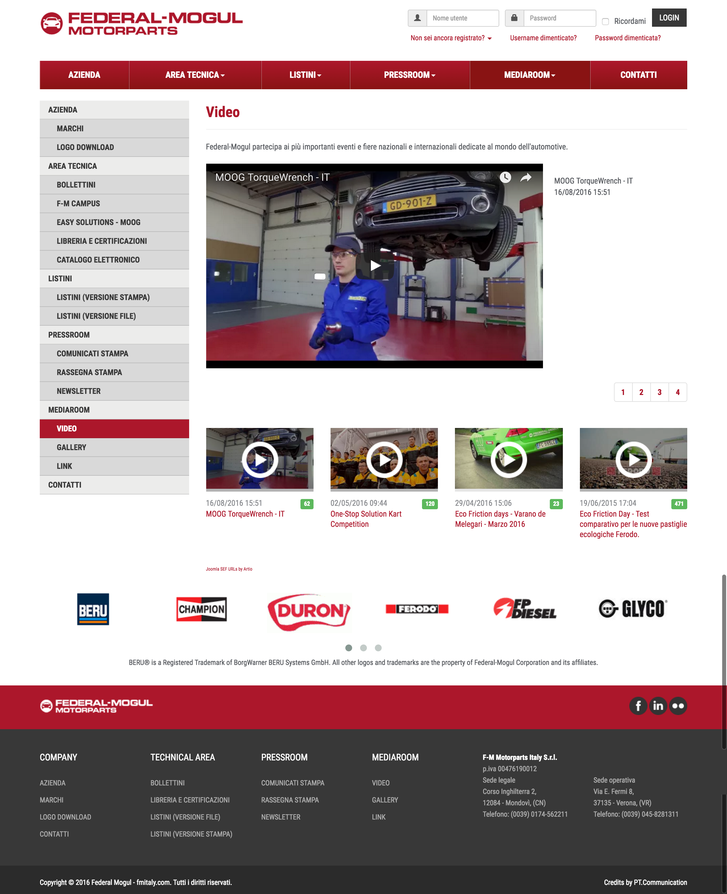

# Federal-Mogul

**Federal-Mogul** Corporation is an American developer, manufacturer and supplier of powertrain components and vehicle safety products. The company’s wide variety of products are used by numerous original equipment manufacturers around the globe, as well as servicers of automotive, commercial, aerospace, marine, rail and off-road vehicles; and industrial, agricultural and power-generation equipment.

We were responsibile for the **Italian**, **Greece** and **Serbian** division.

### Technologies used
* built on **Joomla 3.x** CMS
* responsive **HTML5** and **CSS3** based front-end powered by **jQuery** and **Boostrap 3.x**
* [**IWP**](../iwp/iwp.md) - Incentive Web Platform 3.x

### My contribution
* built all custom back-end components
* custom **IWP** components and modules
* built all custom front-end components and relative module
* skinned web site

## Home Page

## Bulletins

## Lists

## Press Release

## Videos
