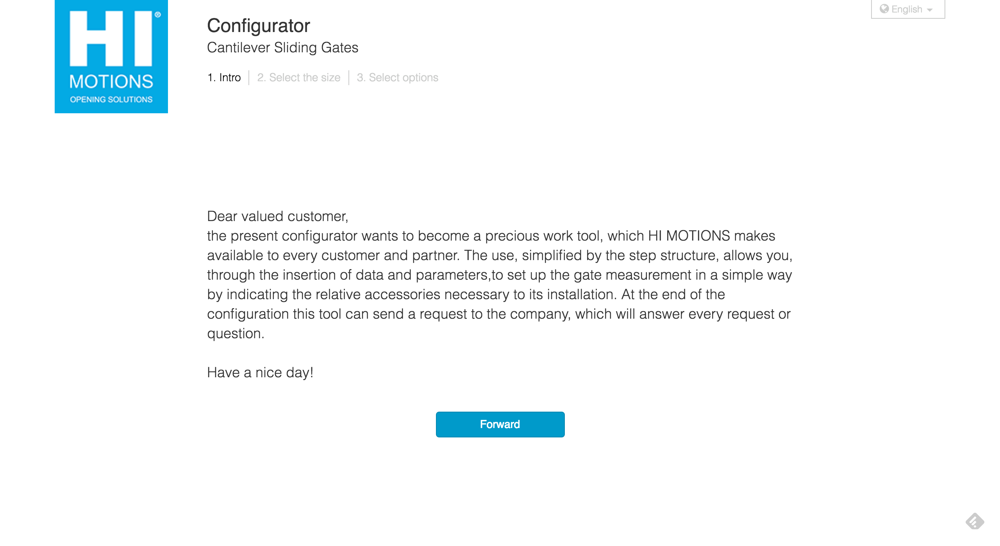

# Hi-Motions

Beninca Holding SpA, a solid leading company with more than 30 years of experience in the field of automation, and a company boasting remarkable expertise and know-how in the sector of gates accessories, join forces and set up a new concern: HI-MOTIONS srl.

We have built the **Configurator** and **price estimator** wizard which consists of guiding the client to find the perfect gate and accessories based on the inserted measurements.

### Technologies used
* built with Processwire CMS for the server side API layer and database manager
* responsive **HTML5** and **CSS3** based front-end powered by **jQuery** and **Boostrap 3.x**
* front-end is a **SPA** (Single Page Application) web app built using **Angular 1.x**

### My contribution
* configured the back-end CMS structure and logic
* build the server side API calls
* built front-end web app
* skinned web site

## Home page

## Step 1


## Step 2

## Step 3
