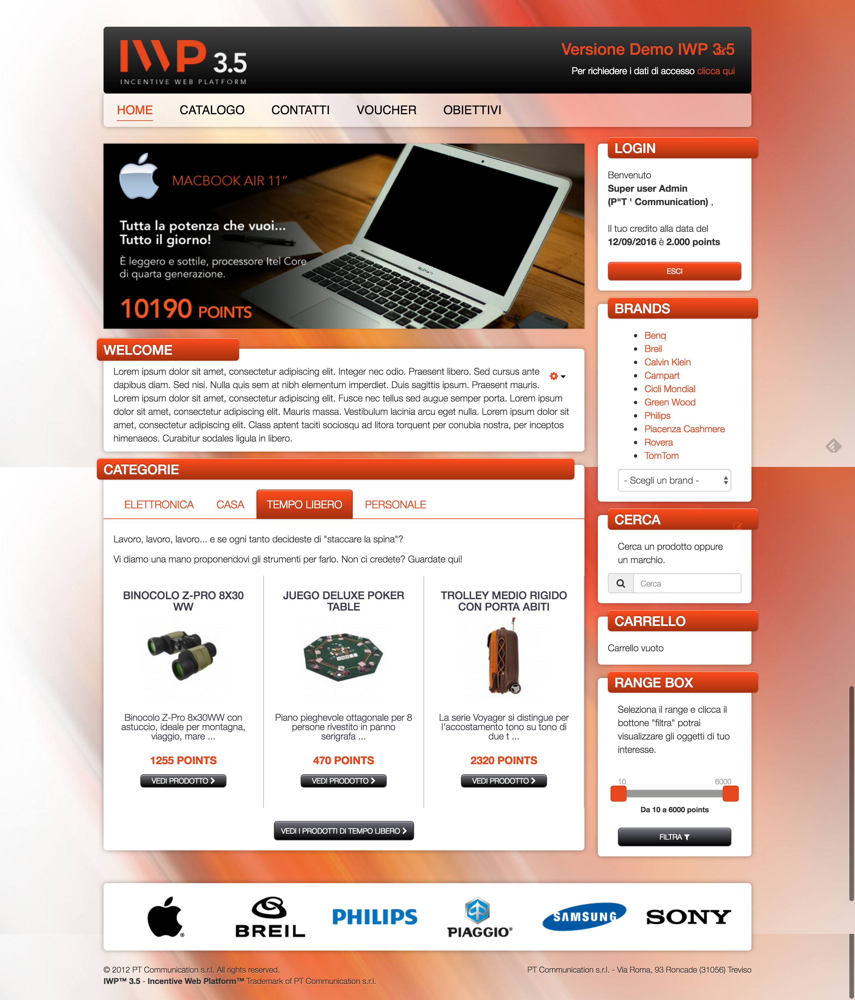
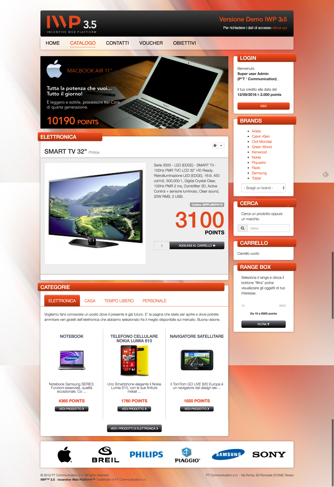
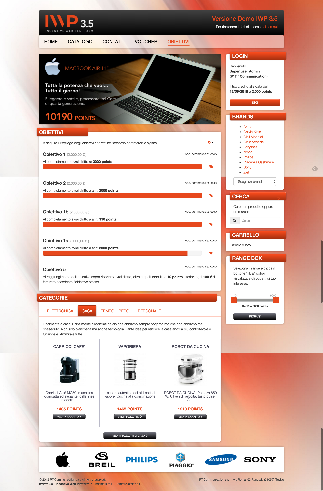
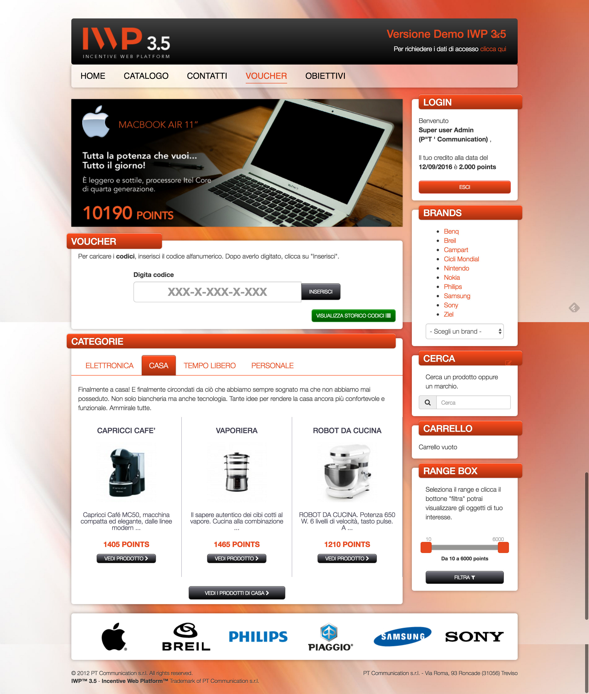
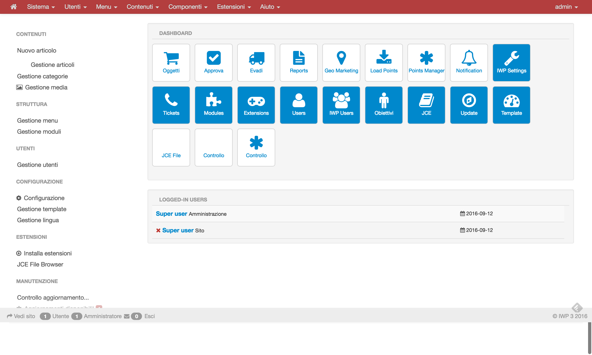

# IWP - Incentive Web Platform

**IWP** is a web platform designed to make easier, efficient and automated the management of the commercial promotions. It was built for large companies to incentivate sell agents. Every revenue made by an agent is converted to **Points** (based on reaching a certain sell objective defined in a commercial agreement) that can be used to buy goods or products inside the custom made and skinned platform.

### Technologies used
* built on **Joomla 3.x** CMS
* responsive **HTML5** and **CSS3** based front-end powered by **jQuery** and **Boostrap 3.x**

### My contribution
* built all custom back-end components
* built e-commerce component
  * Catalog manager (Products/Categories/Brands/Variations/Availabilities)
  * Order processing
  * Custom reports
  * Geomarketing
  * Import/Export
  * Custom user manager
  * Ticket management
  * Points & Objective manager
  * Notifications
  * Voucher manager
* built all custom front-end components an relative module
* various customisations and skins based on the client needs

## Home page

## Catalog

## Product lists

## Product

## Objectives

## Vouchers

## Back-end Administration
