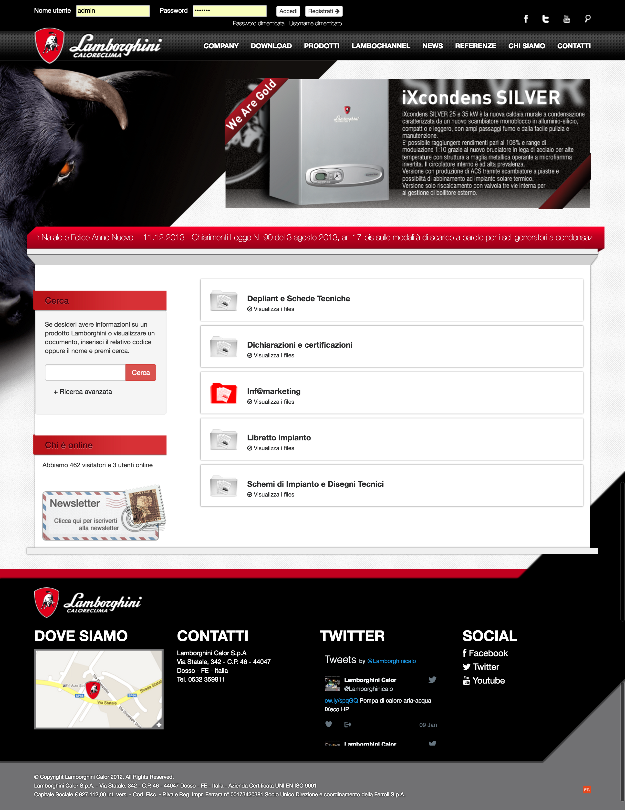
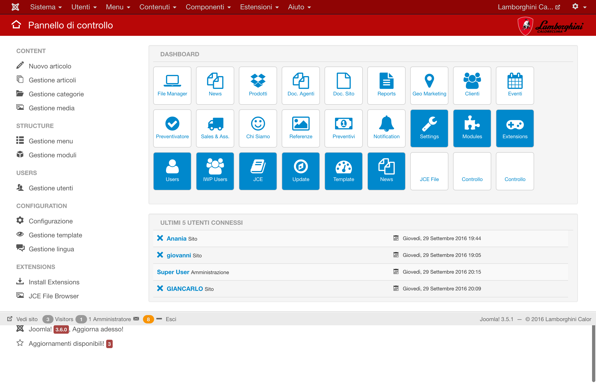

# Lamborghini Calor Clima

The history of Lamborghini begin in 1946. The company has undertaken in a variety of activities recognized all over the world: from automotive to production of burners, solar panels, water treatment, air conditioners, air generators, hydraulic components. Today Lamborghini Calor is recognized as the one from most important companies nationwide, thanks to the large scale of products and solutions and an activity based on a strict quality control.

### Technologies used
* built on **Joomla 3.x** CMS
* responsive **HTML5** and **CSS3** based front-end powered by **jQuery** and **Boostrap 3.x**

### My contribution
* built all custom back-end components
* built all custom front-end components and relative modules
* skinned web site

## Home page

## Products

## Product

## Downloads

## Videos

## Admin

